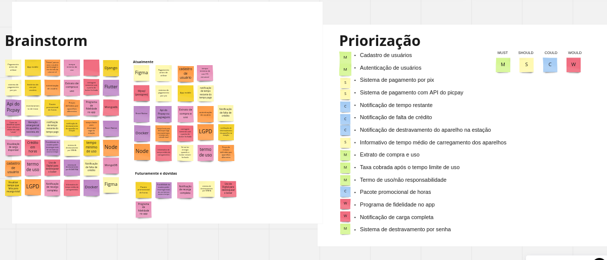
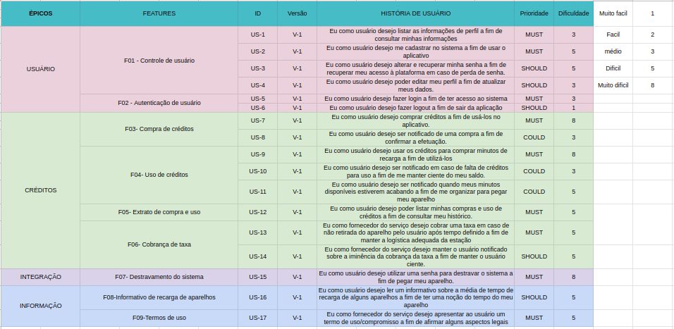

# Título

## Introdução

&emsp;&emsp;Durante o processo de elucidação das ideias que permeiam o desenvolvimento de um software, se faz necessário o levantamento e documentação do que se espera do projeto a ser desenvolvido e das funcionalidades cabíveis ao mesmo de modo que seja compreendido melhor como o desenvolvimento se dará e possa ocorrer de maneira interessante a priorização destas. Esta ação vem com o intuito de organizar o desenvolvimento, para que funcionalidades imprescindíveis para a aplicação sejam construídas de maneira prioritária, mantendo assim uma estrutura inicial da proposta da aplicação e deixando funcionalidades secundárias ou funcionalidades extras para um momento em que o software já possuir uma base adequada.

## Metodologia

### Brainstorming

&emsp;&emsp;O grupo aderiu algumas métricas e ferramentas para esta etapa de maneira a organizar de modo inicial o projeto. Primeiramente um Brainstorming com toda a equipe ocorreu e este foi realizado com o uso da ferramenta Mirro, neste todas as ideias iniciais para o software foram levantadas pelos participantes e colocadas em post-it de maneira que todos pudessem visualizar e ter acesso, assim podendo se expirar e ter novas ideias.

### MoSCoW e Planning Poker

&emsp;&emsp;Em sequência uma tabela com as funcionalidades do sistema foi criada e planilhada no Excel e aqui é aplicado o método MoSCoW, com o intuito de auxiliar na priorização das funcionalidades do sistema. Também foi utilizada a técnica de Planning Poker de modo a estimar qual será a dificuldade de cada uma dessas tarefas listadas.

### Personas

&emsp;&emsp;Entendendo melhor o projeto, suas funcionalidades e seus objetivos principais, foram criadas algumas personas, personagens fictícios, criando com o objetivo de descrever como seria um usuário típico do sistema, desenvolvidos por meio de uma análise de um grupo real de usuários. A finalidade desse processo é, validar ideias do sistema e aumentar a precisão do processo de design.

## Resultados

<h4 align = "center">Figura 1: Brainstorming</h6>

 

<h4 align = "center">Figura 2: Tabela de funcionalidades</h6>

 

## Persona 1 - Antônio Augusto Ribeiro Reis

<table>
  <tr>
    <th>    </th>
    <th>Antônio Augusto Ribeiro Reis - Estudante e trabalhador assalariado com CLT</th>
  </tr>
  <tr>
    <td> 
    <td> 
Nome: Antônio Augusto Ribeiro Reis
25 anos
Gênero: Masculino
Educação: Ensino Superior Incompleto
Trabalho: Estagiário TI

Mídias que utiliza: Instagram, Linkedin, Netflix, Prime Video, Whatsapp, Outlook. Acessa todas essas mídias através do celular ou pelo notebook.

Objetivos: Antônio utiliza sua bicicleta elétrica como principal veículo de locomoção urbana, seria interessante ele poder carregar sua bicicleta elétrica no seu dia a dia fora de casa.

Desafios: Antônio utiliza sua bicicleta elétrica como principal veículo de locomoção urbana. Todo dia ele vai de casa para a faculdade, da faculdade para o escritório, tudo isso com a sua bicicleta elétrica e em suas rotas não possui nenhum local que ele consiga carregar a sua bicicleta se necessário. Algumas vezes ele precisa terminar o percurso pedalando pois a carga da bicicleta acaba no caminho..

Como o projeto pode ajudar: Com o projeto, ele poderia carregar a sua bicicleta durante o percurso casa-faculdade ou faculdade-escritório, podendo carregar a bateria e chegar em casa com menor esforço e em menor tempo.

 </td>
  </tr>
  <tr>
</table>

## Persona 2 - Abel Ferreira de Jesus

<table>
  <tr>
    <th>    </th>
    <th>Abel Ferreira de Jesus  - Empresário</th>
  </tr>
  <tr>
    <td> 
    <td> 
Nome: Abel Ferreira de Jesus
42 anos
Gênero: Masculino
Educação: Ensino Superior Completo	
Trabalho: Empresário

Mídias que utiliza: Twitter, Telegram, Linkedin,Whatsapp, HBO+, Starz,  Gmail. Tem acesso a  essas mídias através do celular, pelo notebook, Smart TV ou desktop.

Objetivos: Antônio é um empresário com um escritório localizado perto de um grande shopping da cidade, ele precisa carregar o seu celular durante seu período de almoço, normalmente ele almoça na praça de alimentação do shopping.

Desafios: Ele precisa carregar seu telefone durante seu período de almoço e no shopping não possui sempre tomadas disponíveis para ele carregar seu celular, e ele não tem a opção de ficar sem bateria pois o celular é indispensável no seu trabalho.

Como o projeto pode ajudar: Com o projeto implantado Abel poderá carregar seu celular sempre que necessário, e deixar de se preocupar em ficar sem sua principal ferramenta de trabalho.

 </td>
  </tr>
  <tr>
</table>

## Persona 3 - Ana Beatriz de Souza Pinheiro

<table>
  <tr>
    <th>    </th>
    <th>Ana Beatriz de Souza Pinheiro  - Estudante</th>
  </tr>
  <tr>
    <td> 
    <td> 
Nome: Ana Beatriz de Souza Pinheiro
18 anos
Gênero: Feminino
Educação: Ensino Médio completo	
Trabalho: Estudante

Mídias que utiliza: Twitter, Telegram, Instagram, Linkedin,Whatsapp, Netflix, Amazon Prime,  Gmail. Tem acesso a  essas mídias através do celular, pelo notebook, Smart TV ou desktop.

Objetivos: Ana Beatriz é uma estudante de graduação em ensino superior, que passa grande parte do seu dia na faculdade e nem sempre possuí um acesso rápido a locais que possibilitam isso.

Desafios: Ela precisa carregar seu celular e geralmente utiliza de horários em que não costuma utilizar o mesmo, horários de aula ou que se encontra estudando na biblioteca, deixando assim o celular no totem de carregamento para que sempre possa ter seu objeto de comunicação disponível e carregado.

Como o projeto pode ajudar: Com o projeto implantado Ana Beatriz poderá carregar seu celular, que ela considera indispensável para o seu dia-a-dia, sempre que necessário, e deixar de se preocupar em ficar sem sua principal ferramenta de comunicação.

 </td>
  </tr>
  <tr>
</table>

## Referências

> - O framework de priorização: MosCoW. Disponível em <https://vidadeproduto.com.br/framework-moscow/>. Acesso em 18 de Novembro de 2022.
> - Planning Poker: A melhor maneira de estimar qualquer atividade. Disponível em <https://www.metodoagil.com/planning-poker/> . Acesso em 18 de Novembro de 2022.
> - Personas: Como utilizá-las no processo de testes de software?. Disponível em <https://medium.com/@erickfosantos/personas-como-utiliz%C3%A1-las-no-processo-de-testes-de-software-f89fe9a3d2aa>. Acesso em 18 de Novembro de 2022.

## Versionamento

| Data  | Versão |                     Descrição                      |  Autor(es)  | Revisor |
| :---: | :----: | :------------------------------------------------: | :---------: | :-----: |
| 19/11 |  1.0   | Adição inicial do tópico 1.2 e seu contéudo |    Luiz Gustavo Dias Paes Pinheiro     |  [Davi Marinho](https://github.com/DaviMarinho)    |
| 20/11 |  1.1   | Adição do contéudo sobre personas |    Luiz Gustavo Dias Paes Pinheiro     |  [Davi Marinho](https://github.com/DaviMarinho)   |