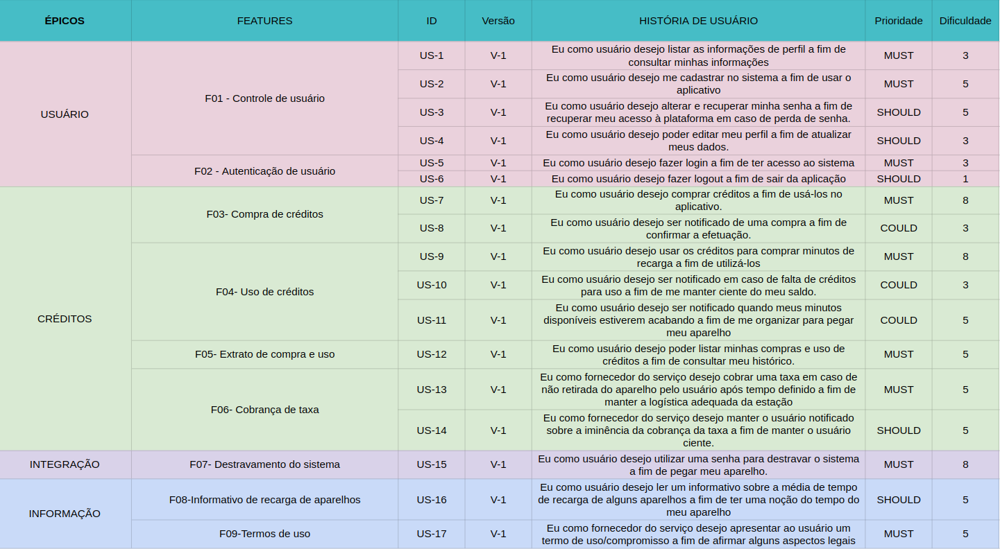

# Backlog

## Introdução

Um backlog é uma lista de tarefas necessárias, planejadas para serem desenvolvidas posteriormente. Ele é contruído após elicitação e priorização dos requisitos. Assim, é possível estrategicamente traçar um plano do que é necessário para começar o desenvolvimento do projeto.  
Nosso backlog é divido em Épico, feature e histórias de usuário, sendo uma força de estruturação que é bastante utilizada no modelo de trabalho ágil. Esse modelo possibilita a organização em diferentes tipos de granularização: alto, médio ou baixo nível.

## Metodologia

O grupo se reuniu para, com base nos requisitos elicitados e priorizados, montar o backlog do produto. Foram utilizados o [miro](https://miro.com/app/board/uXjVPCbXqZE=/?share_link_id=670624690750) e o Google Planilhas.

## Resultados

<h4 align = "center">Figura 1: Backlog priorizado</h6>
<h4 align = "center">Fonte: Autores</h6>

## Referências

Odonodoproduto. Disponível em <https://odonodoproduto.com/epic-feature-and-story-epico-funcionalidade-e-historia/>. Acesso em 19 de novembro de 2022  
FM2S. Disponível em <https://www.fm2s.com.br/blog/backlog>. Acesso em 19 de novembro de 2022  
Robson Camargo. Disponível em <https://robsoncamargo.com.br/blog/Backlog-o-que-e-e-como-pode-ajudar-em-seus-projetos>. Acesso em 19 de novembro de 2022  

## Versionamento

| Data  | Versão |                     Descrição                      |  Autor(es)  | Revisor |
| :---: | :----: | :------------------------------------------------: | :---------: | :-----: |
| 19/11 |  0.1   |                     Criação do documento                   |    [Aline Lermen](https://github.com/AlineLermen), [Davi Marinho](https://github.com/DaviMarinho)        |  XXXX   |