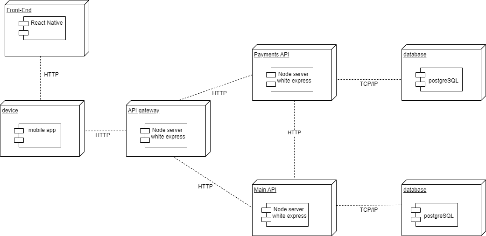

# Diagrama de Implantação

## Introdução

Um diagrama de implantação é um tipo de diagrama UML que são normalmente usados para visualizar o hardware e software físico de um sistema. Usando-o, você pode entender como o sistema será fisicamente implantado no hardware.

## Metodologia

Após um breve entendimento do funcionamento do diaagra a equipe utilizou-se do software Diagrams.net, todos os membros do grupo se reuniram e realizaram a confecção do diagrama enquanto alinhavam as ideias em uma chamada simultânea utilizando o Discord.

## Resultados

<h4 align = "center">Figura 1: Diagrama de Implantação</h6>
<h4 align = "center">Fonte: Autores</h6>

## Referências

O Guia Fácil de Diagramas de Implantação UML. Disponível em <https://creately.com/blog/pt/diagrama/tutorial-do-diagrama-de-implantacao/#:~:text=Um%20diagrama%20de%20implanta%C3%A7%C3%A3o%20%C3%A9,software%20f%C3%ADsico%20de%20um%20sistema.>. Acesso em 19/11.

Criar um diagrama de implantação UML. Disponível em <https://support.microsoft.com/pt-br/office/criar-um-diagrama-de-implanta%C3%A7%C3%A3o-uml-ef282f3e-49a5-48f5-a6ae-69a6982a4543>. Acesso em 19/11.

## Versionamento

| Data  | Versão |                     Descrição                      |  Autor(es)  | Revisor |
| :---: | :----: | :------------------------------------------------: | :---------: | :-----: |
| 19/11 |  0.1   |              Criação do Documento                  | Paulo Vitor |  [Davi Marinho](https://github.com/DaviMarinho)   