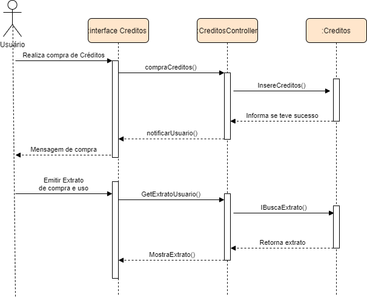

# Diagrama de Sequência 

## Introdução

É um diagrama UML que ilustra a interação de objetos ao longo de um processo. Ele mostra as mensagens entre os participantes e objetos do sistema e a ordem em que ocorrem.

## Metodologia

Esse diagrama foi feito a partir de um econtro por parte dos membros do grupo, usamos como base principalmente conhecimentos adquiridos na disciplina de Arquitetura e Desenho de Software, mas também exemplos que achamos relevantes para o nosso projeto, como o modelo apresentado no site da Microsoft.

## Resultados

A partir desse diagrama, temos uma melhor visão da interação dos objetos ao longo dos processos mostrados nos diagramas, além de desmonstrar as estruturas de controle entre os objetos. 

<h4 align = "center">Figura 1: Diagrama de sequência de cadastro</h6>
<h4 align = "center">Fonte: Autores</h6>

<h4 align = "center">Figura 2: Diagrama de sequência do fluxo de créditos</h6>
<h4 align = "center">Fonte: Autores</h6>

## Referências

> Criar um diagrama de sequência UML. Disponível em: <https://support.microsoft.com/pt-br/office/criar-um-diagrama-de-sequência-uml-c61c371b-b150-4958-b128-902000133b26#OfficeVersion=Newer_desktop_versions> Acessado em 19 de Novembro de 2022.

> Diagramas de Seqüência. Disponível em : <https://www.ibm.com/docs/pt-br/rsm/7.5.0?topic=uml-sequence-diagrams> Acessado em 19 de Novembro de 2022.

## Versionamento

| Data  | Versão |                     Descrição                      |  Autor(es)  | Revisor |
| :---: | :----: | :------------------------------------------------: | :---------: | :-----: |
| 19/11/22 |  1.0  | Criação do documento do Diagrama de Sequência |    [Iago Oliveira](https://github.com/iagoomr)    |  [Paulo Vitor](https://github.com/PauloAbiAcl)  |
| 21/11/22 | 1.1   | Adicionando Diagramas  |     [Paulo Vitor](https://github.com/PauloAbiAcl)  | xxx |