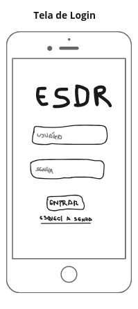
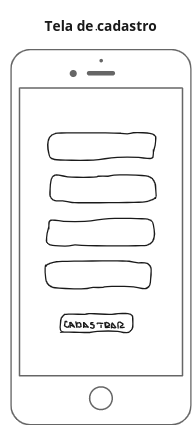
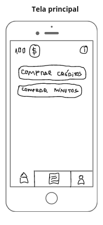
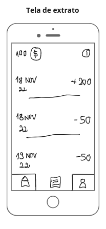
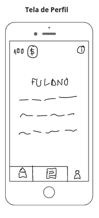
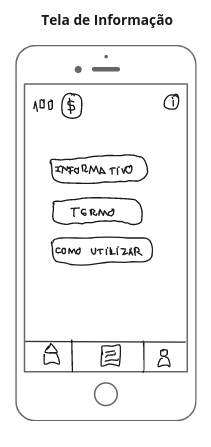
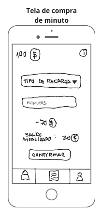
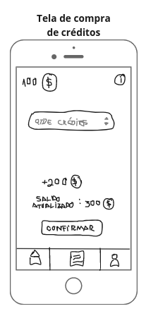

# Protótipo de baixa fidelidade

## Introdução

A primeira etapa de um projeto digital, quando pensamos em design, é criar um protótipo de baixa fidelidade, eles são o primeiro rascunho do produto. Nesse processo a fidelidade está relacionado ao quão realista é a aparência do protótipo com o produto final. Sendo assim o protótipo de baixa não é parecido com o resultado, mas sim um processo até chegar ao resultado final. Normalmente o protótipo de baixa é desenhado utilizando papel e lápis, podendo então ocorrer diversas mudanças no mesmo.
O protótipo de baixa fidelidade visa definir de modo simples como será a interação do usuário com o produto, não se preocupando com o design. 

## Metodologia

O grupo optou por construir protótipo de baixa fidelidade na plataforma [miro](https://miro.com/app/board/uXjVPCRDQrU=/?share_link_id=974108914448), pois faciliria a visualização e interação entre os integrantes durante o processo.

## Resultados

A seguir estão o link para o protótipo, e as imagens das telas 

Protótipo em: <https://miro.com/app/board/uXjVPCRDQrU=/?share_link_id=974108914448>

## Referências

Digital House. Disponível em <https://www.digitalhouse.com/br/blog/prototipo-de-baixa-fidelidade/>. Acesso em 19 de novembro de 2022
Vitamina Web. Disponível em <https://www.vitaminaweb.com.br/fidelidade-de-prototipos-baixa-media-ou-alta/>. Acesso em 19 de novembro de 2022

## Versionamento

| Data  | Versão |                     Descrição                      |  Autor(es)  | Revisor |
| :---: | :----: | :------------------------------------------------: | :---------: | :-----: |
| 19/11 |  0.1   |                     Criação do documento                   |    [Aline Lermen](https://github.com/AlineLermen), [Davi Marinho](https://github.com/DaviMarinho)   |  XXXX   |