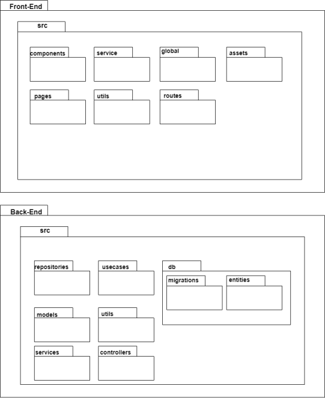

# Documento de Arquitetura

## Introdução

O documento de arquitetura fornece uma visão geral ampla da arquitetura do projeto, usando visualizações arquitetônicas para representar diferentes aspectos do sistema.
## Metodologia

Os resultados obtidos foram realizados em grupos de duas/três pessoas e foi utilizada a plataforma [draw.io](https://app.diagrams.net/) para elaboração dos diagramas que serão apresentados.

## Representação Arquitetural

Apresenta-se neste tópico as tecnologias que serão utilizadas na aplicação e uma representação dos padrões arquiteturais que serão implementados no projeto.

### Front-end
#### React Native
React Native é uma biblioteca Javascript criada pelo Facebook. É usada para desenvolver aplicativos móvel multiplataforma (Android e iOS) utilizando apenas Javascript e de forma nativa. Será utilizado para implementar a interface para o usuário final.

### Back-end
#### Microsserviçoss
Microsserviços é um estilo de arquitetura que estrutura uma aplicação como uma coleção de serviços que são implantáveis de forma independente. A arquitetura de microsserviço permite a entrega rápida, frequente e confiável de aplicativos grandes e complexos. Além disso, facilita a escalabidade do projeto. 
#### Nodejs
Nodejs é um ambiente de execução Javascript server-side, ou seja, que permite executar aplicações desenvolvidas com a linguagem de forma autônoma, sem depender de um navegador. Com isso é possível criar sistemas baseados em microsserviços.

#### Express 
Express é um framework desenvolvido para aplicações web do Nodejs, mínimo e flexível que fornece um conjunto robusto de recursos para aplicativos móvel e APIs, como um sistema de rotas completo, tratamento de exceções, gerenciamento de requisições HTTP entre outros recursos.

### Banco de dados
#### PostgreSQL 
O PostgreSQL é uma ferramenta de gerenciamento de banco de dados relacional, de código aberto que será utilizado para gerenciar os dados das aplicações.

### Outras tecnologias
#### Docker

O Docker é uma plataforma de código aberto que permite aos desenvolvedores criar, implantar, executar, atualizar e gerenciar  contêineres - componentes executáveis ​​padronizados que combinam o código-fonte do aplicativo com as bibliotecas e dependências do sistema operacional (SO) necessárias para executar esse código em qualquer ambiente.
## Visão lógica

### Diagrama de Pacotes

Diagramas de pacotes são diagramas estruturais usados para mostrar, em uma forma de pacotes, a organização e disposição de elementos e de pastas que serão utilizados nos projetos

<h4 align = "center">Figura 1: Diagrama de Pacotes</h6>

## Visão de implatação
### Diagrama de Implatação

O diagrama de implantação é responsável por estabelecer a relação entre os recursos de infraestrutura e artefatos do sistema, em outras palavras, ele mapeia as necessidades do software a ser implantado.

<h4 align = "center">Figura 1: Diagrama de Implatação</h6>

## Referências

Microsserviços. Disponível em <https://microservices.io/>. Acesso em 11 de mês de 2022

Docker. Disponível em <https://www.ibm.com/cloud/learn/docker>. Acesso em 11 de mês de 2022

NodeJs. Disponivel em https://developer.oracle.com/nodejs/what-is-node-js/. Acesso em 11 de mês de 2022

ExpressJs. Disponivel em <https://expressjs.com/pt-br/>. Acesso em 11 de mês de 2022

React Native. Disponivel em <https://reactnative.dev/>. Acesso em 11 de mês de 2022

Diagrama de Pacotes. Disponivel em <https://www.lucidchart.com/pages/pt/diagrama-de-pacotes-uml>. Acesso em 11 de mês de 2022
## Versionamento

| Data  | Versão |                     Descrição                      |  Autor(es)  | Revisor |
| :---: | :----: | :------------------------------------------------: | :---------: | :-----: |
| 19/11 |  0.1   |                     Criação do documento                   |    Lucas Alexandre     |  XXXX   |